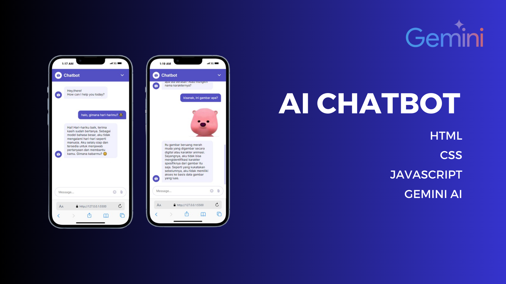
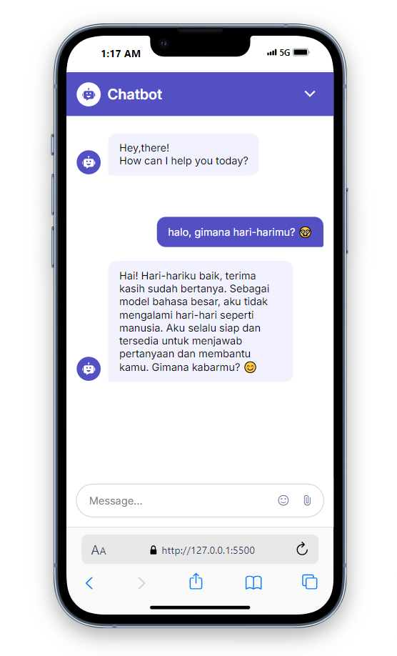
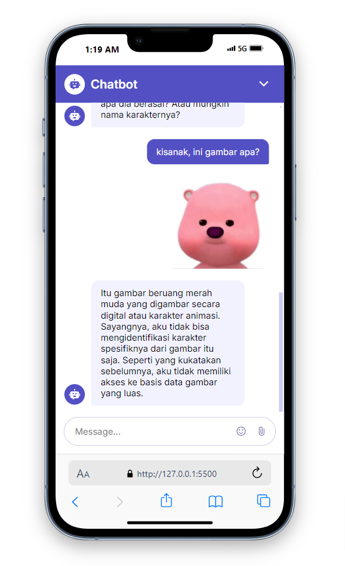

# AI Chatbot Sederhana

## About <a name = "about"></a>

This project is a Gemini AI Chatbot, built using HTML, CSS, and JavaScript. It is designed to provide interactive and intelligent responses to user queries in real-time. The bot leverages Gemini AI capabilities for conversational engagement, making it suitable for educational purposes, customer support, or personal projects.

## ✨ Features

- **Responsive Design**  
  Built with clean HTML and CSS for optimal user experience on both desktop and mobile devices.
- **Interactive Chat Interface**  
  Provides dynamic responses with real-time interactions.

- **Customizable**  
  Easy to modify and expand according to your needs.

## 🚀 Getting Started

1. Clone the repository:
   ```bash
   git clone https://github.com/yourusername/gemini-ai-chatbot.git
   ```
2. Navigate to the project directory:
   ```bash
   cd gemini-ai-chatbot
   ```
3. Open the index.html file in your browser to see the chatbot in action.

## 🛠️ Technologies Used

- HTML
- CSS
- Javascript
- Gemini AI

## 🤝 Contributing

Contributions are welcome! Feel free to submit issues or pull requests to enhance the chatbot.

## 📜 License

This project is licensed under the MIT License.

## 🌟 Support

If you like this project, please give it a ⭐ and share it with others!

### 🖐️ Contact

For any inquiries or feedback, feel free to reach out:  
**Agung Prasetyo** - [GitHub Profile](https://github.com/prazzdev)
